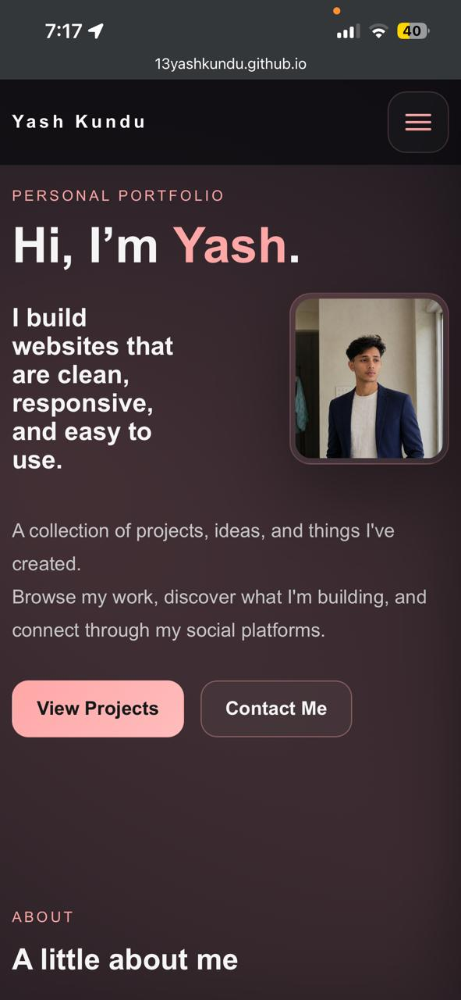

# Portfolio

My Portfolio

A personal portfolio website showcasing projects, skills, and contact information.

## Demo

Open `index.html` in a browser to view the site locally or deploy to GitHub Pages for a live demo.

## Features

- Responsive layout built with HTML and CSS
- Project showcase and links
- Contact section

## Technologies

- CSS 
- HTML
- JavaScript

## Installation / Local setup

1. Clone the repo:

   git clone https://github.com/13yashkundu/Portfolio.git

2. Open `index.html` in your browser.

No build steps are required.

## Screenshots (SS)

## Contact

Created by 13yashkundu — feel free to reach out on GitHub: https://github.com/13yashkundu
